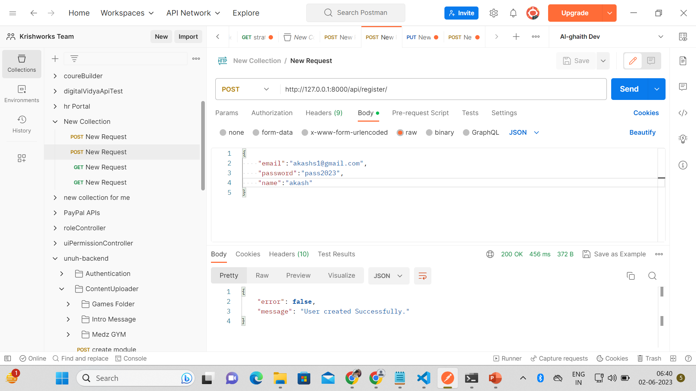
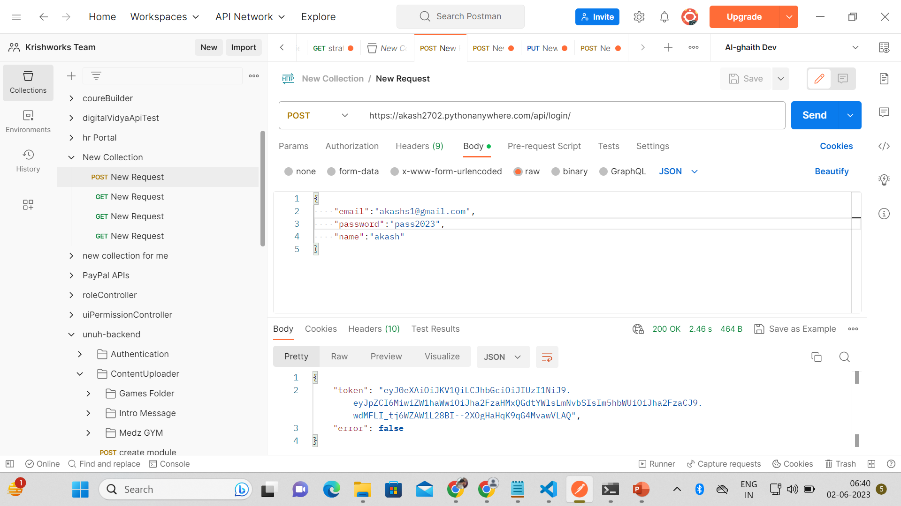
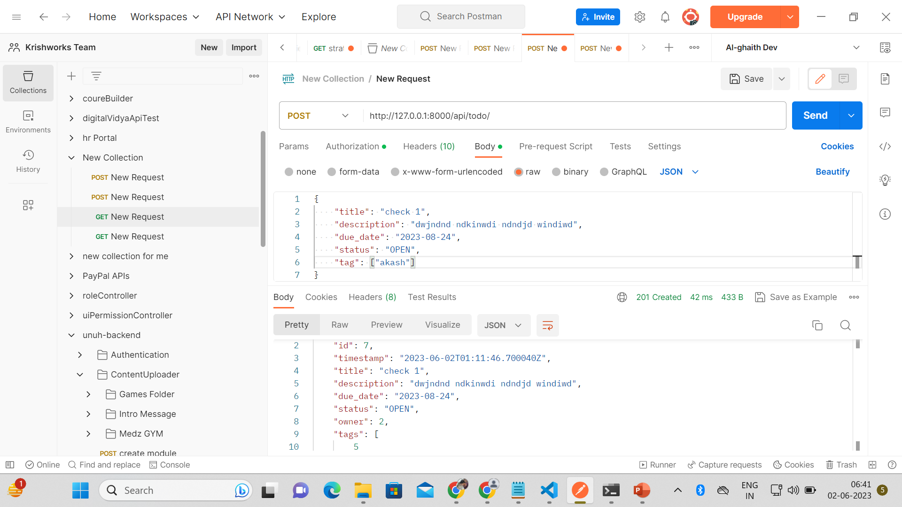
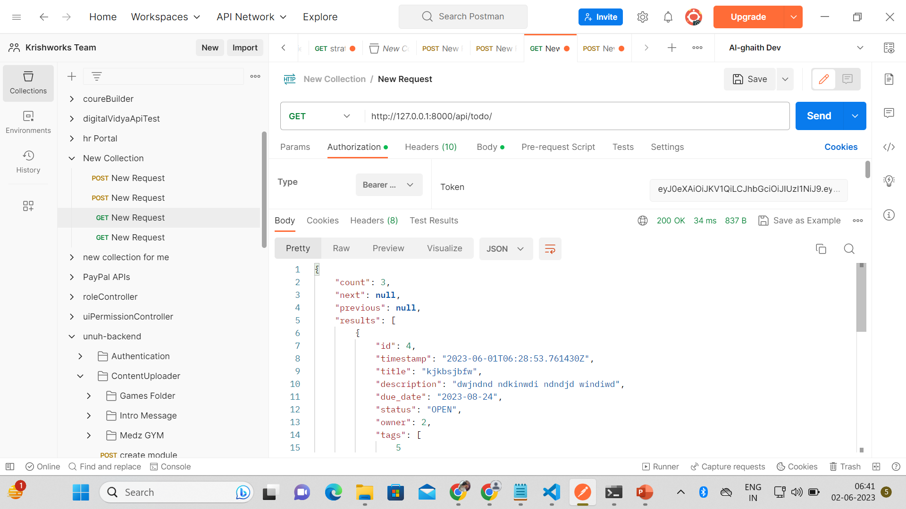
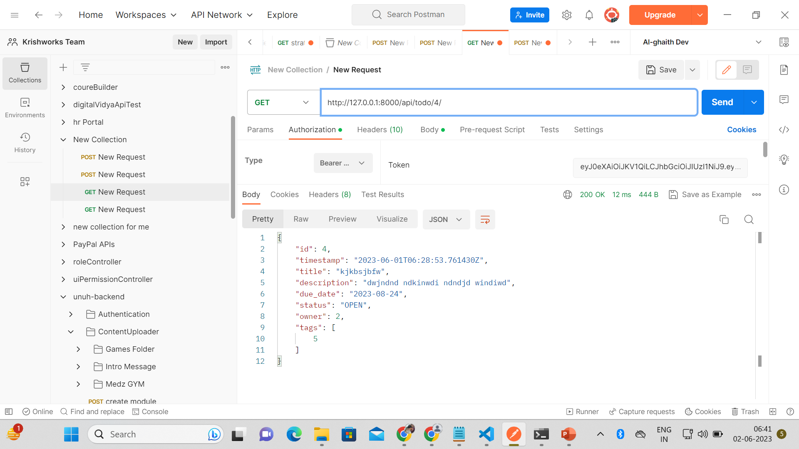
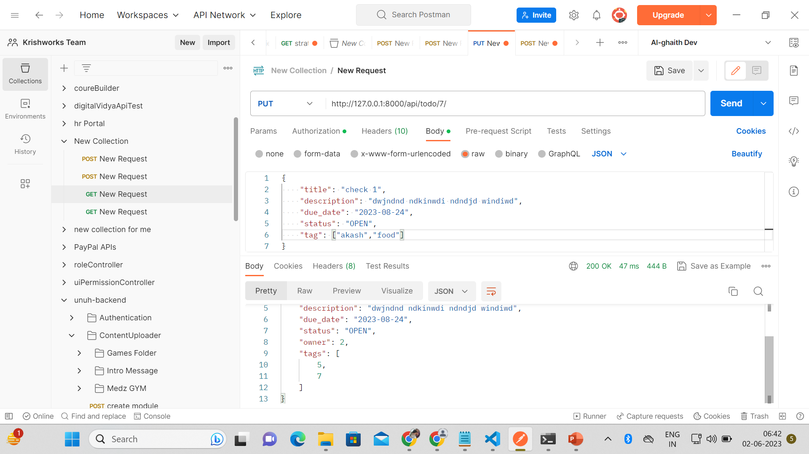
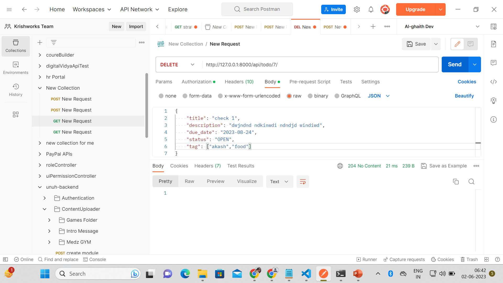

# AlgoBulls
This is an Assignement todo list backend application using Django.

# 1. clone the directory
# 2. move to the project directory where manage.py files exists
# 3. Before starting the project firstly migrates the models using commands
      a-> python manage.py makemigrations
      b-> python manage.py migrate
# 4. After the successFully completetion of migrations the start server using command
      a-> python manage.py runserver
      
      
# Few of the Screenshots of the API's testing in PostMan.
## Register User

## Login In User And used it's token for authenticate the api

## Create Todos for Logged in User

## Get All Todos of the user

## Get Todo 

## Update Todo

## Delete Todo

